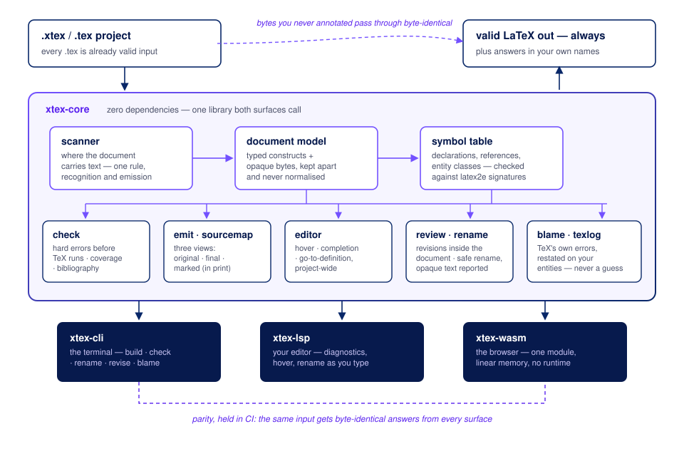

<p align="center">
  
</p>

<p align="center"><strong>Know whether your document is sound before you look at the PDF.</strong></p>

<p align="center">
  <a href="https://github.com/camilochs/exacttex/actions/workflows/rust.yml"></a>
  
  
</p>

ExactTeX is LaTeX with gradual annotation: you name the object you want checked, and what you do not name
stays ordinary LaTeX, transported byte for byte. Rename a `.tex` file to `.xtex` and it keeps working; from
there you choose how much to annotate, and what you annotate is guaranteed.

You can use ExactTeX in the browser today at **[Vitela](https://vitela.artificialfallibility.com/)** —
an editor built on the compiler's WebAssembly build, with the same checks, diagnostics and navigation
running locally in the page.

> **Status: the compiler works, and three doors open into it.** `xtex` parses, checks, emits LaTeX, writes
> source maps and applies revisions; `xtex-lsp` gives an editor diagnostics, hover, completion and
> go-to-definition; and the WebAssembly build runs the same core in any host with no compile server. A
> parity suite holds the three doors to one answer. Every claim below is about what is built, and each
> number is reproducible with the command that produced it.

---

## What it is for

Two things LaTeX cannot do today.

**Errors in your own words.** When something does not fit on the page, LaTeX says:

```
Overfull \hbox (12.3pt too wide) in paragraph at lines 45--47
```

ExactTeX says:

```
your table "results" runs 12.3pt past the right margin
paper.xtex:212 — column 3 does not fit the width you declared
```

Same fact, using the name you gave the object. This works only because you declared it — which is what the
syntax is for. It gives the tooling names to speak with.

**Revisions that live in the file.** Word stores tracked changes inside the `.docx`, which is why tools can
propose edits you accept or reject. LaTeX has no equivalent, so every tool builds its own layer and none of
them interoperate. ExactTeX puts the model in the format.

---

## Try it in a minute

```sh
git clone https://github.com/camilochs/exacttex
cd exacttex
cargo run -p xtex-cli -- check examples/hello.xtex
```

```
coverage: 11.8%
bibliography: unavailable — the document declares no bibliography
```

The file is ordinary LaTeX with one section annotated; the meter says how much of the document is
under contract. Now misspell the reference — change `@ref(sec:results)` to `@ref(sec:resutls)` —
and check again:

```
error[XT1003]: identifier `sec:resutls` is not declared — did you mean `sec:results`?
  --> examples/hello.xtex:6:30
  entity: section
  name: sec:resutls
  span: offset 106, length 11
  --> examples/hello.xtex:4:22: `sec:results` is declared here
  blame: xtex-construct
```

Plain LaTeX would have typeset that as a quiet `??`. Requires a [Rust toolchain](https://rustup.rs)
(1.88 or newer); the compiler itself has zero dependencies to fetch.

## What it looks like

```latex
\documentclass[11pt]{article}
\usepackage{amsmath}

\begin{document}
\section{Introduction}@id(sec:intro)

We argue the opposite in Section~@ref(sec:model), and
@cite(knuth1984) showed that cost grows with $n$.

The architecture is shown in Figure~@ref(fig:runtime).

\figure(fig:runtime) {
  src     = "figures/runtime.pdf"
  width   = 80%
  caption = {Runtime architecture for \emph{multi-agent} systems}
}

@import("sections/model.xtex")

Ordinary LaTeX keeps working: \emph{emphasis}, $E = mc^2$, \citep{blum2020}.
\end{document}
```

Two levels of annotation. `@id(x)` hangs off any LaTeX construct and buys checked references and safe rename
— theorems and algorithms work without ExactTeX knowing what they are. A typed block such as `\figure(x)`
also gives the compiler the fields to check: the image resolves, the caption is there, the column count
matches the `tabular`.

---

## The type system is gradual, and that is the whole design

A document is mostly LaTeX the compiler does not model, and that is not a defect to be fixed later. It is
the state the language is built for.

Every entity is either a class the compiler knows or `?O`, the **unknown open** type:

| Class | Where it comes from |
|---|---|
| `Figure`, `Table` | a typed block — `\figure(fig:x)`, `\table(tab:x)` |
| `Section`, `Appendix`, `Algorithm`, `Equation` | `@id` attached to the LaTeX construct that is one |
| `Citation` | `@cite`, checked against the bibliography rather than against identifiers |
| `?O` | everything else |

`xtex inventory paper.xtex` prints that table for your own document: one line per identifier, with its
class, how many references demand it, and where it was declared.

*Open* is the load-bearing word. `?` in a gradual type system means "unknown among a fixed set of types".
LaTeX has no fixed set — any package may define new constructors at any time — so the unknown here is
unbounded. The term is from Malewski, Greenberg and Tanter, *Gradually Structured Data* (OOPSLA 2021).

Comparison is **consistency**, not equality, and two lines are the entire checking policy:

```
Known(A) ~ Known(B)   if and only if A == B     <- this can fail
?O       ~ T          for every T               <- this never fails
```

`?O` is consistent with everything, so nothing involving unmodelled LaTeX can be inconsistent, so nothing
involving unmodelled LaTeX can fail. **`?O` marks absence of grounds, not invalidity.**

Two consequences worth stating plainly.

**Renaming a `.tex` to `.xtex` and changing nothing checks clean, because every entity in it is `?O`.**
That holds by construction, without case-by-case care. That is the gradual guarantee (Siek, Vitousek, Cimini and
Boyland, SNAPL 2015) instantiated for documents, and it is what makes the on-ramp real rather than a
promise.

**You choose how much to annotate, and the compiler tells you how much you chose.** `xtex check` reports
coverage: the fraction of the document it checked. This is the analogue of `any` and `noImplicitAny`. The
number matters less than its trend: a file that was 60% checked and is now 30% gained something the
parser cannot model.

The check that types buy, and that no LaTeX tool performs: `@ref(fig:main)` pointing at a `\table(fig:main)`
— the prefix demands a figure, the declaration is a table. Its sibling: `Figure~@ref(tab:main)` on a
table — the sentence says figure, the declaration says table. LaTeX compiles both and prints the wrong
word. See [`docs/checking.md`](docs/checking.md) and
[`docs/decisions/0019`](docs/decisions/0019-prose-is-a-checked-side.md).

---

## How it is built



One zero-dependency core; three thin surfaces (terminal, editor, browser) that call it and are held byte-identical by a parity suite in CI; and the transport guarantee drawn where it belongs — outside the pipeline, because unannotated bytes are carried, never processed. The full walk: [docs/architecture.md](docs/architecture.md).

External verification — bibliography entries, URLs, DOIs and repositories checked against live
sources — lives behind its own door: a separate step writes a dated record, and the compiler replays
it offline, so the network never enters a compile. How and why: [docs/verification.md](docs/verification.md).

---

## What it is not

It is not a shorter way to write LaTeX. TypeScript is more verbose than JavaScript; nobody adopted it to type
less. You write more so the tooling knows more.

It does not replace TeX, does not typeset, and does not ask you to leave the LaTeX ecosystem. Your journal
still receives a `.tex` file.

---

## How young this is

The compiler is young, and pretending otherwise would waste your time.

What is solid: the transport guarantee — untouched LaTeX comes out
byte-identical — is the oldest invariant here and the most heavily tested. The
checker, the emitter and the two surfaces (WebAssembly and LSP) answer
identically for the same input, and a parity suite in CI holds them to it. A
book of a little over a hundred pages — forty packages, an index, per-chapter
bibliographies and TikZ compiles to the same page count as a full TeX Live.

Where it is still tender: the change model. Three defects surfaced in one
evening of real use in August 2026 — a revision written inside `\author{…}`
was resolvable on screen and printed into the PDF as itself; a reply outlived
the change it answered; and rejecting one left a stray space behind. All three
were the same thing seen from three sides: two code paths consulting different
rules about where a document carries text. They are fixed, each with a test
that fails against the previous compiler, and `tests/dialogues.rs` now runs a
full conversation through a title page, a caption, a nested command, a table
cell and a list item.

Which is the honest summary: **the parts that transport your document are
careful; the parts that let people argue about it are new.** If you find
something, the thing to send is the document.

---

## Documentation

The full documentation lives at **<https://camilochs.github.io/exacttex/>** — the language
specification, what the compiler calls an error, the change model, the WebAssembly and LSP
surfaces, and every accepted decision with the evidence behind it. The same pages are the
[`docs/`](docs/) folder in this repository, one Markdown file each.

Two documents are binding for anyone changing the code: [`PHILOSOPHY.md`](PHILOSOPHY.md)
(what may be claimed) and [`AGENTS.md`](AGENTS.md) (invariants and workflow).

---

## License

MIT. See [`LICENSE`](LICENSE).

An [AF Labs](https://labs.artificialfallibility.com/) project.

If ExactTeX is useful to you, a star on this repository helps others find it — and tells us it is worth the care.
