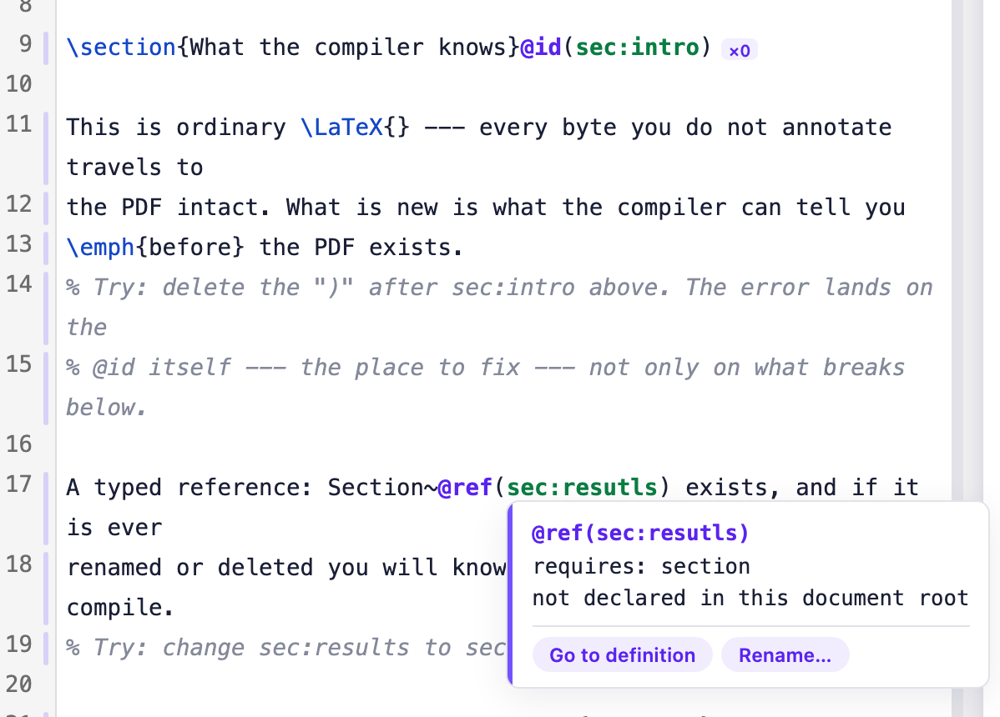

<p align="center">
  
</p>

<p align="center"><strong>Know whether your document is sound before you look at the PDF.</strong></p>

<p align="center">
  <a href="https://github.com/camilochs/exacttex/actions/workflows/rust.yml"></a>
  
  
  <a href="https://github.com/camilochs/exacttex/releases"></a>
  
  <a href="https://camilochs.github.io/exacttex/"></a>
</p>

ExactTeX is LaTeX with gradual annotation. You name the objects you want checked; everything else stays
ordinary LaTeX and comes out unchanged. Rename a `.tex` file to `.xtex` and it still compiles. Annotate as
much or as little as you want. What you annotate is checked.

The paper I had in mind has forty figures and three coauthors. Rename `fig:runtime` and every reference
follows. Write `Figure~\ref` on a table and the compiler tells you, before the PDF prints the wrong word
and nobody notices. The pain was never the types. It was the silent `??`.

You can try it in the browser at [Vitela](https://vitela.artificialfallibility.com/), an editor built on
the compiler's WebAssembly build. The checks run locally in the page.

<p align="center">
  
</p>

---

## What it does

**Errors in your own words.** ExactTeX does not typeset. `xtex compile` hands the emitted LaTeX to the engine
you name (`tectonic` by default), reads the `.log` it leaves, and maps each warning back through the source
map to the entity that encloses it. When a table is too wide, TeX says:

```
Overfull \hbox (99.82014pt too wide) in paragraph at lines 7--10
```

ExactTeX says:

```
warning[TEX]: table `tab:wide` overflows its line by 99.82014pt
  TeX said: Overfull \hbox (99.82014pt too wide) in paragraph at lines 7--10
  emitted at build/wide.tex:7
  corresponds to wide.xtex:3:1
```

Same fact, with the name you gave the table. That is what the annotations are for: they give the tooling
names to use.

**Revisions inside the file.** Word keeps tracked changes inside the `.docx`, so other tools can propose
edits you accept or reject. LaTeX has nothing like it, and every tool builds its own incompatible layer.
ExactTeX puts the change model in the file format. A proposed change is text in the document:

```latex
The gain is @sub(change:gain) {dramatic -> consistent} across both corpora.
```

The file still builds. `xtex build paper.xtex --marked` prints the change for reading, old text struck
through and new text in colour:

```latex
The gain is \textcolor{red}{\sout{dramatic}}\textcolor{blue}{consistent} across both corpora.
```

`--original` and `--final` build the document without the change and with it. Accepting is a rewrite of the
source, and a change that has been accepted is no longer a change:

```sh
xtex revise paper.xtex --accept change:gain
```

```latex
The gain is consistent across both corpora.
```

A sidecar file, `paper.xtexrev`, records who proposed each change and when. Rejecting keeps the removed text
there, so a paragraph thrown away in review can still be produced six months later. A coauthor, a reviewer
or a coding agent can propose; only the author accepts. The model is in [docs/revisions.md](docs/revisions.md).

**Plain LaTeX out.** Your journal receives a `.tex` file. This block:

```latex
\figure(fig:runtime) {
  src     = "figures/runtime.pdf"
  width   = 80%
  caption = {Runtime architecture for \emph{multi-agent} systems}
}
```

is emitted by `xtex build` as:

```latex
\begin{figure}
  \centering
  \includegraphics[width=0.80\linewidth]{figures/runtime.pdf}
  \caption{Runtime architecture for \emph{multi-agent} systems}
  \label{fig:runtime}
\end{figure}
```

and `@ref(fig:runtime)` becomes `\ref{fig:runtime}`. Everything you did not annotate is carried around the
compiler untouched, so the emitted file is yours to keep if you stop using ExactTeX tomorrow.

---

## Try it

There are no prebuilt binaries yet. With a [Rust toolchain](https://rustup.rs) (1.88 or newer), one
command builds and installs the compiler; it has no dependencies to fetch:

```sh
cargo install --git https://github.com/camilochs/exacttex xtex-cli
```

Then, on the example in this repository:

```sh
git clone https://github.com/camilochs/exacttex
cd exacttex
xtex check examples/hello.xtex
```

```
coverage: 11.8%
bibliography: unavailable — the document declares no bibliography
```

The file is ordinary LaTeX with one section annotated. `coverage` is the share of the document under
check. Now misspell the reference: change `@ref(sec:results)` to `@ref(sec:resutls)` and check again.

```
error[XT1003]: identifier `sec:resutls` is not declared — did you mean `sec:results`?
  --> examples/hello.xtex:6:30
  entity: section
  name: sec:resutls
  span: offset 106, length 11
  --> examples/hello.xtex:4:22: `sec:results` is declared here
  blame: xtex-construct
```

Plain LaTeX would have typeset a `??` and said nothing.

Renaming is a command, and it follows every reference across the project:

```sh
xtex rename paper.xtex sec:results sec:findings
```

```
paper.xtex: 1 renamed
```

**In your editor.** The same checks run as you type through a language server:

```sh
cargo install --git https://github.com/camilochs/exacttex xtex-lsp
```

`xtex-lsp` speaks LSP over stdin and stdout and takes no arguments. Point your editor's "custom language
server" setting at it for `.xtex` files. It answers diagnostics on every keystroke, hover, completion, go to
definition and rename. The protocol it speaks, message by message, is in [docs/lsp.md](docs/lsp.md).

---

## What it looks like

```latex
\documentclass[11pt]{article}
\usepackage{amsmath}

\begin{document}
\section{Introduction}@id(sec:intro)

We argue the opposite in Section~@ref(sec:model), and
@cite(knuth1984) showed that cost grows with $n$.

The architecture is shown in Figure~@ref(fig:runtime).

\figure(fig:runtime) {
  src     = "figures/runtime.pdf"
  width   = 80%
  caption = {Runtime architecture for \emph{multi-agent} systems}
}

@import("sections/model.xtex")

Ordinary LaTeX keeps working: \emph{emphasis}, $E = mc^2$, \citep{blum2020}.
\end{document}
```

There are two levels of annotation. `@id(x)` attaches to any LaTeX construct and gives you checked
references and `xtex rename`; theorems and algorithms work without ExactTeX knowing what they are. A typed
block such as `\figure(x)` also gives the compiler fields to check: the image exists, the caption is
present, the column count matches the `tabular`.

---

## The type system is gradual

Most of a document is LaTeX the compiler does not model. That is the normal state, and the language is
built for it.

Every entity is either a class the compiler knows or `?O`, the unknown open type:

| Class | Where it comes from |
|---|---|
| `Figure`, `Table` | a typed block: `\figure(fig:x)`, `\table(tab:x)` |
| `Section`, `Appendix`, `Algorithm`, `Equation` | `@id` attached to the LaTeX construct |
| `Citation` | `@cite`, checked against the bibliography |
| `?O` | everything else |

`xtex inventory paper.xtex` prints this table for your document: one line per identifier, with its class,
how many references use it, and where it was declared.

"Open" matters. In a gradual type system `?` means "unknown among a fixed set of types". LaTeX has no fixed
set, because any package can define new constructors, so the unknown here is unbounded. The term comes from
Malewski, Greenberg and Tanter, *Gradually Structured Data* (OOPSLA 2021).

Comparison is consistency rather than equality. The whole checking policy is two lines:

```
Known(A) ~ Known(B)   if and only if A == B     <- this can fail
?O       ~ T          for every T               <- this never fails
```

`?O` is consistent with everything, so nothing that involves unmodelled LaTeX can fail. `?O` means the
compiler has no grounds to judge, and nothing more.

Two consequences follow.

Renaming a `.tex` to `.xtex` and changing nothing checks clean, because every entity in it is `?O`. This is
the gradual guarantee (Siek, Vitousek, Cimini and Boyland, SNAPL 2015) applied to documents, and it is why
the on-ramp works.

You choose how much to annotate, and the compiler reports how much you chose. `xtex check` prints coverage,
the fraction of the document it checked. It is the analogue of `any` and `noImplicitAny`. The trend
matters more than the number: a file that went from 60% to 30% gained something the parser cannot model.

One check that types make possible and no LaTeX tool performs: `@ref(fig:main)` pointing at a
`\table(fig:main)`. The prefix says figure; the declaration says table. Likewise `Figure~@ref(tab:main)`
on a table: the sentence says figure, the declaration says table. LaTeX compiles both and prints the wrong
word. See [`docs/checking.md`](docs/checking.md) and
[`docs/decisions/0019`](docs/decisions/0019-prose-is-a-checked-side.md).

---

## How it is built


One core with no dependencies. Three thin surfaces (terminal, editor, browser) call it, and a parity suite
in CI keeps their output byte-identical. Unannotated bytes never enter the pipeline; they are carried
around it. The full description is in [docs/architecture.md](docs/architecture.md).

External verification (bibliography entries, URLs, DOIs and repositories checked against live sources) is a
separate step. It writes a dated record, and the compiler replays that record offline, so a compile never
touches the network. See [docs/verification.md](docs/verification.md).

---

## How early this is

The compiler is still young. And yes, I built it with agents; without them, it would have taken months. The design, however, is mine.

---

## Documentation

<https://camilochs.github.io/exacttex/> has the language specification, what the compiler calls an error,
the change model, the WebAssembly and LSP surfaces, and every accepted decision with its evidence. The same
pages live in [`docs/`](docs/), one Markdown file each.

Two documents bind anyone changing the code: [`PHILOSOPHY.md`](PHILOSOPHY.md) (what may be claimed) and
[`AGENTS.md`](AGENTS.md) (invariants and workflow).

---

## License

MIT. See [`LICENSE`](LICENSE).

An [AF Labs](https://labs.artificialfallibility.com/) project.
